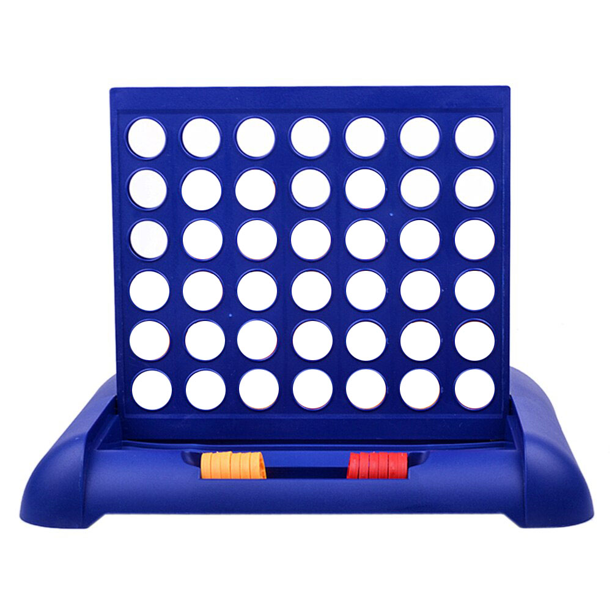

<html>
<head><link rel="stylesheet" type="text/css" href="style.css"></head>
<body>

    <table id="thetable">

        <tr>
            <th><button type="button" value="0" onclick="Runtime(0)">Place 1</button></th>
            <th><button type="button" value="1" onclick="Runtime(1)">Place 2</button></th>
            <th><button type="button" value="2" onclick="Runtime(2)">Place 3</button></th>
            <th><button type="button" value="3" onclick="Runtime(3)">Place 4</button></th>
            <th><button type="button" value="4" onclick="Runtime(4)">Place 5</button></th>
            <th><button type="button" value="5" onclick="Runtime(5)">Place 6</button></th>
            <th><button type="button" value="6" onclick="Runtime(6)">Place 7</button></th>
        </tr>
        <tr>
            <td></td>
            <td></td>
            <td></td>
            <td></td>
            <td></td>
            <td></td>
            <td></td>
        </tr>
        <tr>
            <td></td>
            <td></td>
            <td></td>
            <td></td>
            <td></td>
            <td></td>
            <td></td>
        </tr>
        <tr>
            <td></td>
            <td></td>
            <td></td>
            <td></td>
            <td></td>
            <td></td>
            <td></td>
        </tr>
        <tr>
            <td></td>
            <td></td>
            <td></td>
            <td></td>
            <td></td>
            <td></td>
            <td></td>
        </tr>
        <tr>
            <td></td>
            <td></td>
            <td></td>
            <td></td>
            <td></td>
            <td></td>
            <td></td>
        </tr>
        <tr">
            <td></td>
            <td></td>
            <td></td>
            <td></td>
            <td></td>
            <td></td>
            <td></td>
            </tr>

    </table>

    

    
Player 1's Turn!

    <button type="button" class="reset" onclick="Reset()">Reset Board</button>
    <h5>EECS 368 w/ Andy Gill - Darrin Ternes: KUID 2858325</h5>

    

</body>

</html>